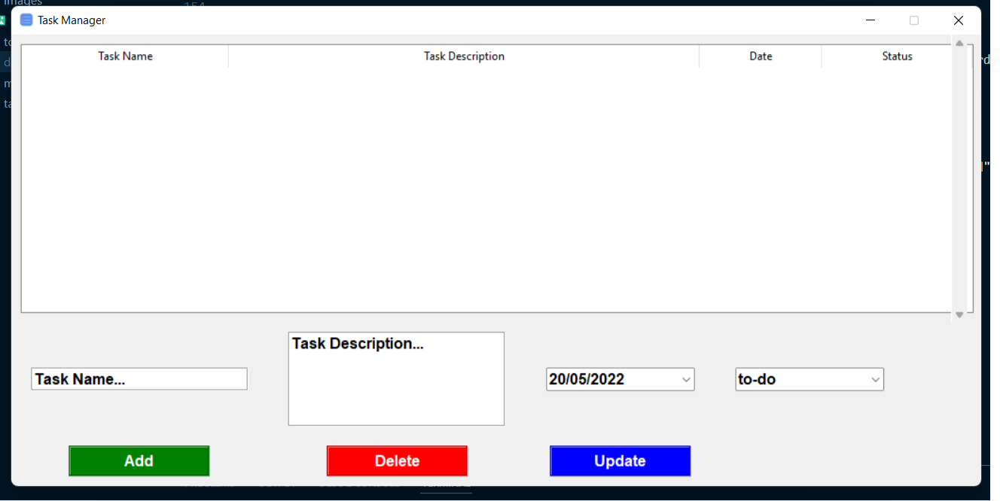
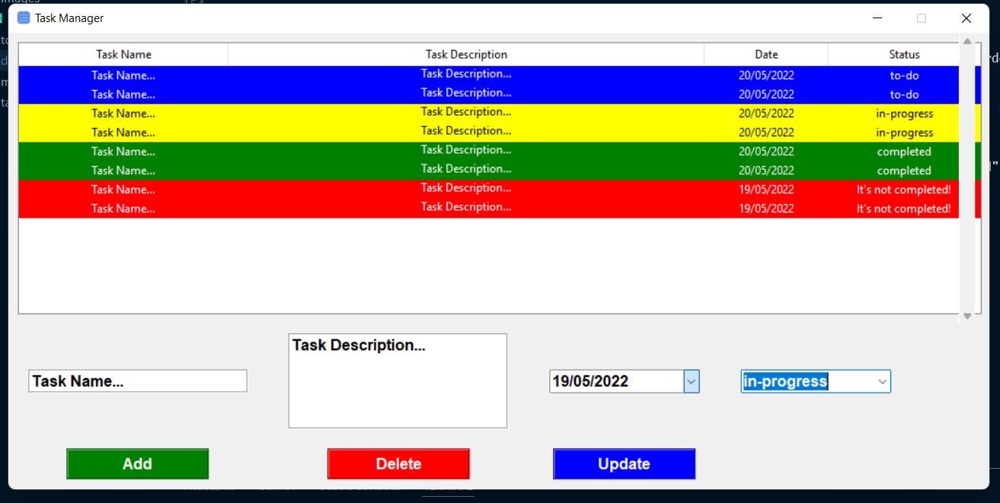

# Task Manager App using Tkinter GUI

1. Here user can add, update, delete tasks.
2. User will be able to see all the task that have been added into the application.
3. Each new assigned to-do task will be given a blue background color.
4. If to-do task is not completed before due date, it will be given a red background color and mail will be sent.
5. In-progress task will be given a yellow background color.
6. If in-progress task is not completed before due date, it will be given a red background color and mail will be sent.
7. Completed tasks will be given a green background color.

## Screenshots

